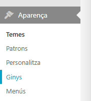

# Implementació d'Esdeveniments Extra

A continuació es detallen els passos per afegir esdeveniments personalitzats (efecte de flocs de neu i regals) al web.

### 1. Accés als ginys d'administració
Accedim al Nodes amb el compte d'**admin** i ens dirigim a **Aparença** ➔ **Ginys**.

### 2. Afegir el bloc de contingut
Afegim un element **HTML personalitzat** a un dels blocs del **Footer** (peu de pàgina).

### 3. Inserció del codi lògic (JavaScript)
Copiem el contingut de `index.js` i l'enganxem dins del quadre de text del giny HTML personalitzat que acabem de crear.

### 4. Aplicació dels estils (CSS)
Copiem l'estil CSS del fitxer `index.css` i l'enganxem a la secció **Personalitza** ➔ **CSS addicional** del tema de WordPress. Tal i com s'especifica a la cerpeta **`Improves/`**.
